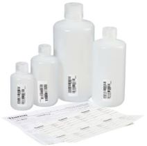
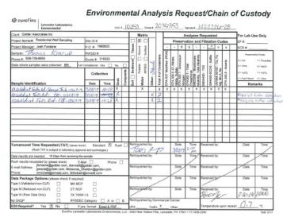

[//]: # (Audience: entry level environmental staff conducting field sampling. They will be familiar with how to conduct sampling, the purpose of sampling, and laboratory standards like COCs. This is designed to be a general guide--specifics that may vary depending on the company, project, or laboratory are not detailed. Instead, this guide is intended to follow general industry practices.)
 # How to Collect a Field Blank
 Field blanks are one type of artificial sample used for quality assurance and quality control when conducting environmental sampling. Their purpose is to indicate any contamination originating from transport, handling, or field conditions. The project proposal will specify the number of field blanks to sample. Contact your PM with any questions.
 ## Required Equipment
### Staff Provided Equipment:
 - Marker or pen
- Disposable gloves
- Ice

### Laboratory Provided Equipment:
- Deionized (DI) water 
- Sample bottleware and label
- Chain of Custody (COC)
- Cooler
- Sample bag

## Steps
1. Put on the disposable gloves.
2. Pour the DI water directly into the sample bottle and fill to the required amount. 
    * Ensure the DI water does not come into contact with any field soil or water.
    * If using a filter when sampling, use a filter when preparing the field blank.
3. Close the sample bottle (see Figure 1), making sure that the cap is tightened.
    > 
    > 
    > Figure 1: Sampling bottleware as sold by [Thermo Fisher Scientific](https://www.thermofisher.com/order/catalog/product/N319-0125#/N319-0125)
4. Remove the disposable gloves.
5. Prepare a label with the client name, date and time, sample ID, sampler, and laboratory analysis.
    * The sample ID should indicate that the sample is a field blank. Example: FB-01_09-09-2021.
    * Check the project proposal for the appropriate analysis.
6. Apply the label to the sampling bottle.
7. Place the sampling bottle inside a sample bag and zip shut.
8. Place the bagged sample bottle inside the iced cooler.
9. Fill out the COC (see Figure 2) with sample details.
    > 
    > 
    > Figure 2: Example COC prepared by [Golder Associates, Inc](https://www4.des.state.nh.us/IISProxy/IISProxy.dll?ContentId=4771881).
10. At the end of the day, return the field blank with the environmental samples and COC to the laboratory for analysis.
